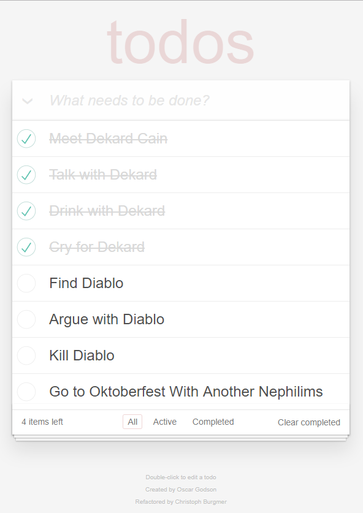

# Openclassrooms Project 8



This project aims to enhance an existing project following the next points:

- Fix some bugs on code
- Add Some test adopting a TDD approach
- Analyze performance of a competitor
- Make an Performance Audit Report -> [Go to Audit on Wiki](https://github.com/Atileon/OC-p8/wiki/Competitor-Audit-Report)
- Write a Technical Documentation -> [Documentation(Wiki)](https://github.com/Atileon/OC-p8/wiki)

**To Install just Clone Repo or Download:**

```
$git clone https://github.com/Atileon/OC-p8.git
```

**And:**

```
$npm install
```

### [More Information...](https://github.com/Atileon/OC-p8/wiki 'Wiki wiki')